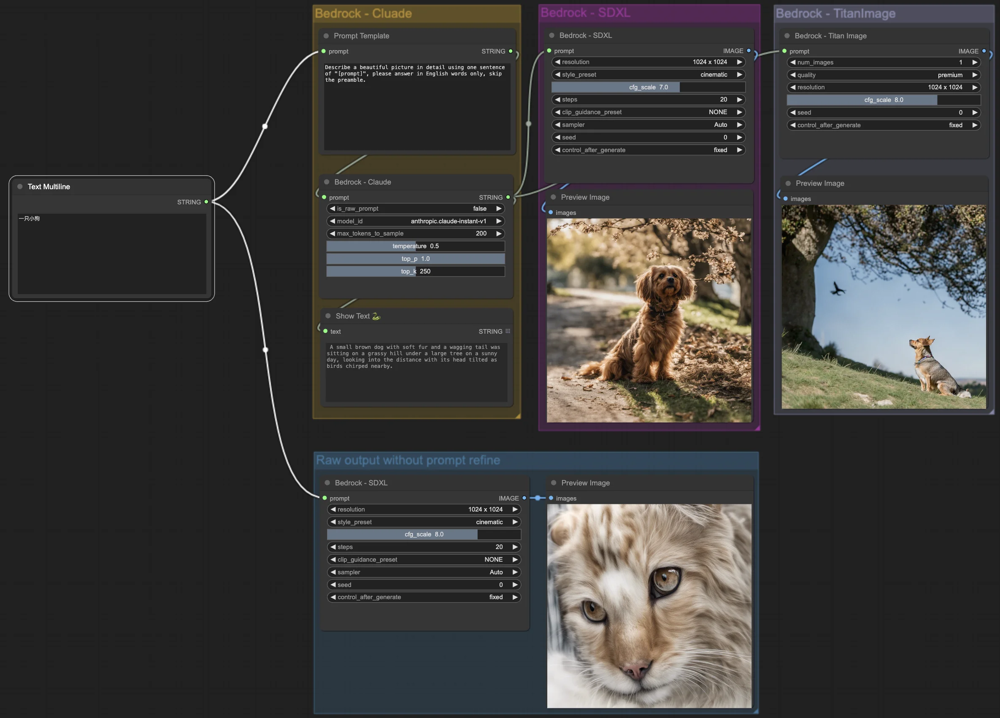

# Amazon Bedrock nodes for ComfyUI

Amazon Bedrock is a fully managed service that offers a choice of high-performing foundation models (FMs) from leading AI companies.
This repo is the ComfyUI nodes for Bedrock service. You could invoke the foundation model in your ComfyUI pipeline.

## Installation
Clone this repository to your ComfyUI `custom_nodes` directory:
``` bash
pip install boto3
cd ComfyUI/custom_nodes
git clone https://github.com/yytdfc/ComfyUI-Bedrock.git
```


## Example

For example, you could use the Bedrock LLM to refine the prompt input and get a better result. Here is an example of doing prompt translation and refinement, and the invoke the image generation model (eg. SDXL, TitanImage) provided by Bedrock.
The result is much better after preprocessing of prompt compared to the original SDXL model (the bottom output), which doesn't have the capability of understanding Chinese. Workflow examples are in `./workflows`.



## Support models:

Here are models ready for use, more models are coming soon.

- Anthropic:
    - [x] Claude (1.x, 2.0, 2.1)
    - [x] Claude Instant (1.x)

- Amazon:
    - [x] Titan Image Generator G1 (1.x)

- Stability AI:
    - [x] Stable Diffusion XL (1.0)

